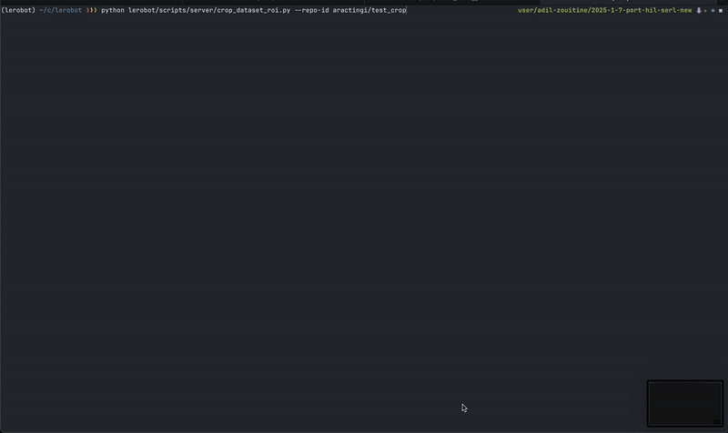
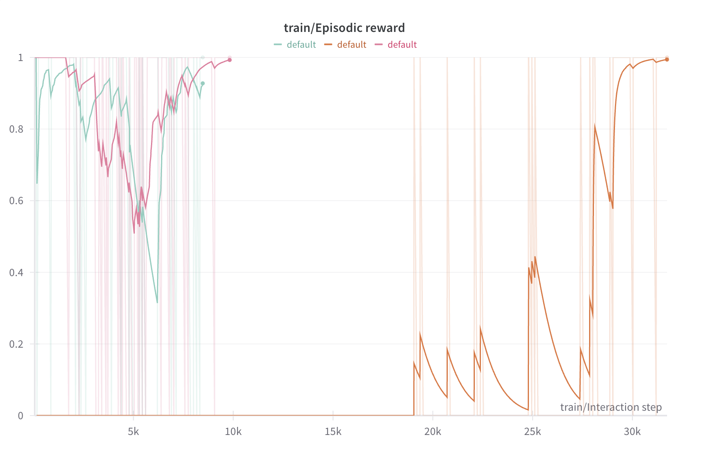

## 🚨🚨 This REPO is deprecated, follow the full guide on the [LeRobot Docs]([url](https://huggingface.co/docs/lerobot/index)) 🚨🚨
https://huggingface.co/docs/lerobot/index

# HilSerl Real Robot Training Workflow Guide

This guide provides step-by-step instructions for training a robot policy using LeRobot's HilSerl implementation to train on a real robot.

## Table of Contents

- [Understanding Configuration](#understanding-configuration)
- [Step 1: Finding Robot Workspace Bounds](#step-1-finding-robot-workspace-bounds)
- [Step 2: Collecting Demonstrations](#step-2-collecting-demonstrations)
- [Step 3: Processing the Dataset](#step-3-processing-the-dataset)
- [Step 4: Training with Actor-Learner](#step-4-training-with-actor-learner)
- [Monitoring and Debugging](#monitoring-and-debugging)

## Understanding Configuration

The training process begins with proper configuration for the HILSerl environment. The configuration class of interest is `HILSerlRobotEnvConfig` in `lerobot/common/envs/configs.py`. Which is defined as:

```python
class HILSerlRobotEnvConfig(EnvConfig):
    robot: Optional[RobotConfig] = None    # Robot hardware configuration to define the robot type
    wrapper: Optional[EnvWrapperConfig] = None    # Environment wrapper settings; check `lerobot/scripts/server/gym_manipulator.py`
    fps: int = 10    # Control frequency
    name: str = "real_robot"    # Environment name
    mode: str = None    # "record", "replay", or None (for training)
    repo_id: Optional[str] = None    # LeRobot dataset repository ID
    dataset_root: Optional[str] = None    # Local dataset root (optional)
    task: str = ""    # Task identifier
    num_episodes: int = 10    # Number of episodes for recording
    episode: int = 0    # episode index for replay
    device: str = "cuda"    # Compute device
    push_to_hub: bool = True    # Whether to push the recorded datasets to Hub
    pretrained_policy_name_or_path: Optional[str] = None    # For policy loading
    reward_classifier_pretrained_path: Optional[str] = None    # For reward model
```


## Step 1: Finding Robot Workspace Bounds

Before collecting demonstrations, you need to determine the appropriate operational bounds for your robot.

This helps simplifying the problem of learning on the real robot by limiting the robot's operational space to a specific region that solves the task and avoids unnecessary or unsafe exploration.

### Using find_joint_limits.py

This script helps you find the safe operational bounds for your robot's end-effector:

```bash
python lerobot/scripts/server/find_joint_limits.py --mode ee --control-time-s 60 --robot-type so100
```

Arguments:
- `--mode`: Set to `ee` for end-effector workspace bounds or `joint` for joint limits
- `--control-time-s`: Duration to collect position samples (in seconds)
- `--robot-type`: Robot model (e.g., "so100", "koch", "moss")

### Workflow

1. Run the script and move the robot through the space that solves the task
2. The script will record the minimum and maximum end-effector positions and print them to the console
   ```
   Max ee position [0.24170487 0.201285   0.10273342]
   Min ee position [0.16631757 -0.08237468  0.03364977]
   ```
3. Use these values in your configuration's `ee_action_space_params.bounds` field

### Example Configuration

```json
"ee_action_space_params": {
    "x_step_size": 0.03,  
    "y_step_size": 0.03,  
    "z_step_size": 0.03, 
    "bounds": {
        "max": [0.24, 0.20, 0.10],
        "min": [0.16, -0.08, 0.03]
    },
    "control_mode": "gamepad"
}
```

## Step 2: Collecting Demonstrations

With the bounds defined, you can collect demonstrations for training.

### Setting Up Record Mode

Create a configuration file for recording demonstrations (or edit an existing one like `env_config_so100.json`):

1. Set `mode` to `"record"` 
2. Specify a unique `repo_id` for your dataset (e.g., "username/task_name")
3. Set `num_episodes` to the number of demonstrations you want to collect
4. Set `crop_params_dict` to `null` initially (we'll determine crops later)
5. Configure `robot`, `cameras`, and other hardware settings

Example configuration section:
```json
"mode": "record",
"repo_id": "username/pick_lift_cube",
"dataset_root": null,
"task": "pick_and_lift",
"num_episodes": 15,
"episode": 0,
"push_to_hub": true
```

### Gamepad Controls

The following image shows the gamepad button mapping used during recording:

<p align="center">

</p>


<p align="center"><i>Gamepad button mapping for robot control and episode management</i></p>


### Recording Demonstrations

Start the recording process:

```bash
python lerobot/scripts/server/gym_manipulator.py --config_path lerobot/configs/env_config_so100.json
```

During recording:
1. The robot will reset to the initial position defined in the configuration file `fixed_reset_position`
2. Use the gamepad to control the robot (`use_gamepad` is enabled)
3. Complete the task successfully
4. The episode ends with a reward of 1 when you press the "success" button 
5. If the time limit is reached, or the fail button is pressed, the episode ends with a reward of 0
6. You can rerecord an episode by pressing the "rerecord" button
7. The process automatically continues to the next episode
8. After recording all episodes, the dataset is pushed to the Hugging Face Hub (optional) and saved locally


## Step 3: Processing the Dataset

After collecting demonstrations, process them to determine optimal camera crops.
Reinforcement learning is sensitive to background distractions, so it is important to crop the images to the relevant workspace area.
Note: If you already know the crop parameters, you can skip this step and just set the `crop_params_dict` in the configuration file during recording.

### Determining Crop Parameters

Use the `crop_dataset_roi.py` script to interactively select regions of interest in your camera images:

```bash
python lerobot/scripts/server/crop_dataset_roi.py --repo-id username/pick_lift_cube
```

1. For each camera view, the script will display the first frame
2. Draw a rectangle around the relevant workspace area
3. Press 'c' to confirm the selection
4. Repeat for all camera views
5. The script outputs cropping parameters and creates a new cropped dataset

Example output:
```
Selected Rectangular Regions of Interest (top, left, height, width):
observation.images.side: [180, 207, 180, 200]
observation.images.front: [180, 250, 120, 150]
```

<p align="center">

</p>

<p align="center"><i>Interactive cropping tool for selecting regions of interest</i></p>


### Updating Configuration

Add these crop parameters to your training configuration:

```json
"crop_params_dict": {
    "observation.images.side": [180, 207, 180, 200],
    "observation.images.front": [180, 250, 120, 150]
},
"resize_size": [128, 128]
```

## Step 4: Training with Actor-Learner

The LeRobot system uses a distributed actor-learner architecture for training. You will need to start two processes: a learner and an actor.

### Configuration Setup

Create a training configuration file (See example `train_config_hilserl_so100.json`). The training config is based on the main `TrainPipelineConfig` class in `lerobot/configs/train.py`.

1. Set `mode` to `null` (for training mode)
2. Configure the policy settings (`type`, `device`, etc.)
3. Set `dataset` to your cropped dataset
4. Configure environment settings with crop parameters
5. Check the other parameters related to SAC.
6. Verify that the `policy` config is correct with the right `input_features` and `output_features` for your task.

### Starting the Learner

First, start the learner server process:

```bash
python lerobot/scripts/server/learner_server.py --config_path lerobot/configs/train_config_hilserl_so100.json
```

The learner:
- Initializes the policy network
- Prepares replay buffers
- Opens a gRPC server to communicate with actors
- Processes transitions and updates the policy

### Starting the Actor

In a separate terminal, start the actor process with the same configuration:

```bash
python lerobot/scripts/server/actor_server.py --config_path lerobot/configs/train_config_hilserl_so100.json
```

The actor:
- Connects to the learner via gRPC
- Initializes the environment
- Execute rollouts of the policy to collect experience
- Sends transitions to the learner
- Receives updated policy parameters

### Training Flow

The training proceeds automatically:

1. The actor executes the policy in the environment
2. Transitions are collected and sent to the learner
3. The learner updates the policy based on these transitions
4. Updated policy parameters are sent back to the actor
5. The process continues until the specified step limit is reached

### Human in the Loop

- The key to learning efficiently is to have a human interventions to provide corrective feedback and completing the task to aide the policy learning and exploration.
- To perform human interventions, you can press the upper right trigger button on the gamepad. This will pause the policy actions and allow you to take over. 
- A successful experiment is one where the human has to intervene at the start but then reduces the amount of interventions as the policy improves. You can monitor the intervention rate in the `wandb` dashboard.

<p align="center">

</p>

<p align="center"><i>Example showing how human interventions help guide policy learning over time</i></p>

- The figure shows the plot of the episodic reward over interaction step. The figure shows the effect of human interventions on the policy learning.
- The orange curve is an experiment without any human interventions. While the pink and blue curves are experiments with human interventions.
- We can observe that the number of steps where the policy starts acheiving the maximum reward is cut by a quarter when human interventions are present.

#### Guide to Human Interventions
The strategy to follow is to intervene heavily at the start of training and then reduce the amount of interventions as the training progresses. Some tips and hints:
- Interevene for almost the length of the entire episode at the first few episodes.
- When the policy is less chaotic, gradually reduce the intervention time during one episode and let the policy explore for a longer time.
- Once the policy start guiding the robot towards acheiving the task, even if its not perfect, you can limit your interventions to simple quick actions like a grasping command, or grasp and lift command. 

## Monitoring and Debugging

If you have `wandb.enable` set to `true` in your configuration, you can monitor training progress in real-time through the Weights & Biases dashboard. 
